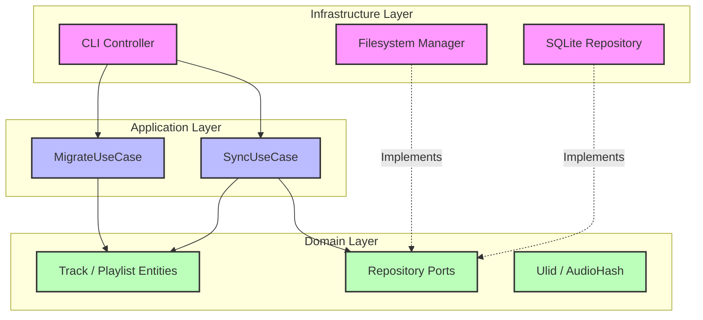
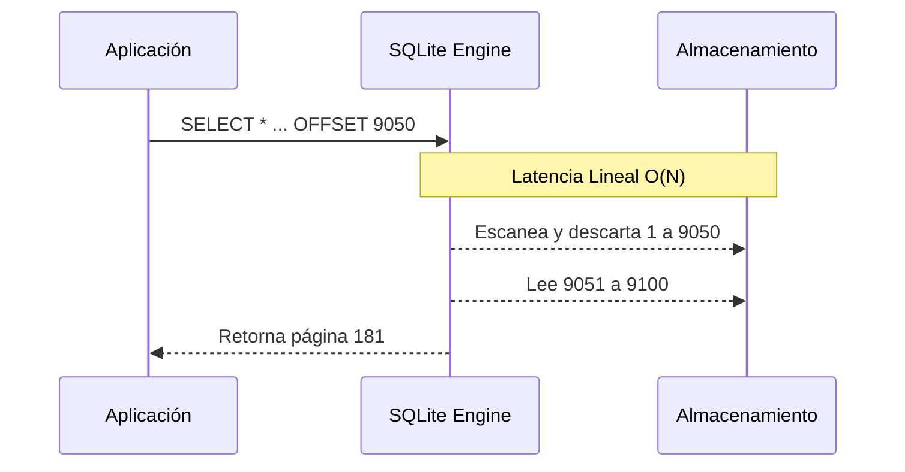
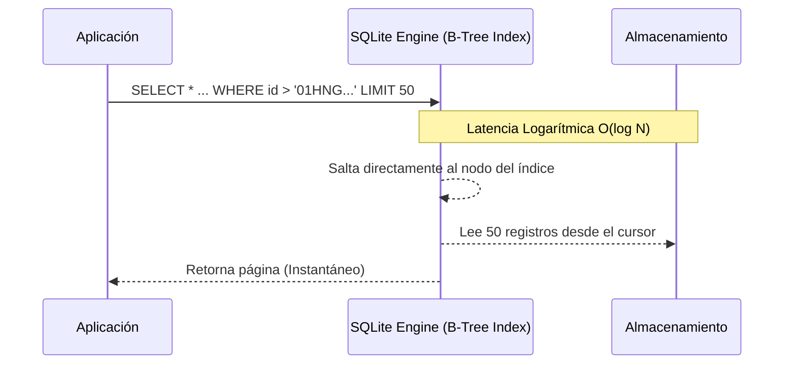

# Arquitectura y Decisiones de Diseño: Music Manager

Este documento detalla la arquitectura fundamental, los patrones de diseño aplicados y las decisiones técnicas tomadas para la construcción del gestor de bibliotecas musicales masivas.

## 1. Visión General del Sistema

El sistema es una herramienta multiplataforma diseñada inicialmente como una Interfaz de Línea de Comandos (CLI). Su propósito es gestionar, indexar y migrar bibliotecas de música de gran escala (>10,000 pistas), asegurando la integridad criptográfica de los binarios y ofreciendo tiempos de respuesta casi instantáneos en las consultas.

## 2. Patrón Arquitectónico: Clean Architecture / Hexagonal

Se ha adoptado la **Arquitectura Limpia (Clean Architecture)** impulsada por Robert C. Martin, en combinación con el patrón de **Arquitectura Hexagonal (Ports and Adapters)** de Alistair Cockburn.



### 2.1. Justificación de la Arquitectura
La decisión de usar este modelo arquitectónico responde al requisito de construir un sistema altamente escalable y agnóstico a los detalles de entrega. 
* **Extensibilidad Futura:** Al iniciar como una CLI, el núcleo de la lógica no debe estar acoplado a la terminal. Si en el futuro se desea inyectar los Casos de Uso en un servidor web (REST/GraphQL) o una GUI (Tauri/Electron), el dominio y la lógica de aplicación no sufrirán alteraciones.
* **Testabilidad:** Al depender de abstracciones (Puertos), se pueden crear "Mocks" en memoria de las bases de datos o sistemas de archivos para realizar Test-Driven Development (TDD) puro sobre la lógica de negocio.

### 2.2. Flujo de Dependencias (Regla de Dependencia)
Las dependencias en el código fuente **siempre apuntan hacia el interior**. El círculo exterior (Infraestructura) depende del interior (Aplicación y Dominio), pero nunca al revés.

## 3. Disposición del Código Topológico (Capas)

El código se divide estrictamente en tres anillos concéntricos dentro de `src/`:

### 3.1. Capa de Dominio (`src/domain/`)
Es el núcleo sagrado de la aplicación. Representa los conceptos del negocio. **No tiene dependencias externas** (Ni base de datos, ni red, ni SO).
* **Entidades (`entities/`):** Modelos de datos enriquecidos con comportamiento (ej. `Track`).
* **Value Objects (`value_objects/`):** Estructuras inmutables que representan un valor, no una identidad (ej. `AudioHash`, `Ulid`). Se prefiere el uso de ULID sobre UUIDv4 por sus propiedades de ordenamiento cronológico.
* **Puertos Primares y Secundarios (`ports/`):** Contratos definidos mediante `Traits` en Rust. Definen qué requiere el Dominio del exterior sin saber cómo se implementa (ej. `TrackRepository`).

### 3.2. Capa de Aplicación (`src/application/`)
Contiene los **Casos de Uso** asilados de la aplicación.
* Orquestan el flujo de datos hacia y desde las Entidades y llaman a los Puertos para persistir o recuperar información.
* Ejemplos: `scan_library`, `migrate_tracks`.
* No saben si los comandos provienen de una CLI o de un HTTP request.

### 3.3. Capa de Infraestructura (`src/infrastructure/`)
Implementa los detalles técnicos (Los Adaptadores).
* **Database (`database/`):** Implementaciones concretas de los puertos de repositorios usando SQLite (`sqlite_repository.rs`).
* **Filesystem (`filesystem/`):** Implementaciones para interactuar asíncronamente con binarios en el disco físico.
* **UI/CLI (`cli/`):** Controlador de comandos en terminal utilizando `clap`. Adapta la solicitud del usuario de la terminal y lanza el Caso de Uso adecuado.

### 3.4. Composition Root (`src/main.rs`)
El punto de ensamblaje único. Su única responsabilidad es:
1. Leer variables de entorno / configuración.
2. Instanciar los adaptadores de infraestructura (ej. Conexión a SQLite).
3. Inyectar dependencias instanciando los Casos de Uso con sus respectivos adaptadores.
4. Entregar el control a la Interfaz (CLI).

---

## 4. Decisiones Técnicas y Tecnológicas (Tech Stack)

### 4.1. Lenguaje: Rust
* **Por qué Rust:** Para manejar I/O intenso, streaming de miles de binarios pesados simultáneamente y cálculos de Hash criptográficos al vuelo, se requiere rendimiento C/C++. Rust ofrece esto garantizando en tiempo de compilación la ausencia de Memory Leaks y Data Races en escenarios de alta concurrencia.
* No tiene recolector de basura (GC), asegurando baja latencia sostenida y un consumo de RAM predecible y minúsculo, ideal para procesos de fondo.

### 4.2. Concurrencia y Asincronismo: `tokio`
* El I/O (lectura de disco y base de datos) será 100% asíncrono y no bloqueante para maximizar el throughput durante el escaneo de miles de directorios.
* Se utilizará un patrón de Productor-Consumidor apoyado por "Worker Pools" limitados para no saturar los descriptores de archivos del Sistema Operativo.

### 4.3. Base de Datos Embebida: SQLite (vía `sqlx`)
* **Justificación:** Al no necesitar un servidor residente (como PostgreSQL), facilita la distribución multiplataforma e instalación "Zero-Config".
* **Pragmas Críticos:** Se utilizará fuertemente el modo **WAL (Write-Ahead Logging)** (`PRAGMA journal_mode=WAL`) para evadir los bloqueos nativos de SQLite y permitir lecturas concurrentes simultáneas a escrituras masivas.

### 4.4. Hashing Criptográfico Rápido: BLAKE3
* Durante la migración de binarios (movimiento de `.mp3/.flac`), se debe garantizar la integridad de los mismos.
* En lugar de MD5 o SHA256, se opta por `BLAKE3`, un algoritmo criptográfico significativamente más rápido en hardware moderno. El *hash* se calcula en *streaming* mientras el archivo viaja de un buffer al otro de memoria hacia su destino de disco, resultando en un coste de latencia añadido casi cero.

## 5. Estrategia de Paginación Extrema

Para manejar más de 10,000 registros sin un ápice de latencia en la iteración visual o la exportación, se desecha categóricamente la paginación estándar por "Offsets".

### 5.1. El problema de `OFFSET`
Implementar queries del tipo `SELECT * FROM tracks LIMIT 50 OFFSET 9050` ocasiona que el motor SQLite escanee y descarte 9,050 registros inútilmente antes de retornar la página solicitada (Latencia lineal $O(N)$). Esto penaliza las páginas profundas.



### 5.2. Solución: Keyset Pagination (Cursor-Based)
* Se integrará paginación por cursores.
* Gracias a la elección de **ULID** (Universally Unique Lexicographically Sortable Identifier) como identificador principal (`TrackId`), las IDs son intrínsecamente seriales y ordenables en el tiempo (a diferencia de un UUIDv4 caótico).
* Las queries para la siguiente iteración se estructurarán como:
  ```sql
  SELECT * FROM tracks WHERE id > :cursor_ulid ORDER BY id ASC LIMIT 50
  ```
* Al existir un índice `B-Tree` en la columna `id`, el motor de base de datos saltará inmediatamente al nodo del cursor exacto en tiempo logarítmico ($O(log N)$), haciendo que extraer la página número 1 demore exactamente lo mismo que extraer la página 5,000.


